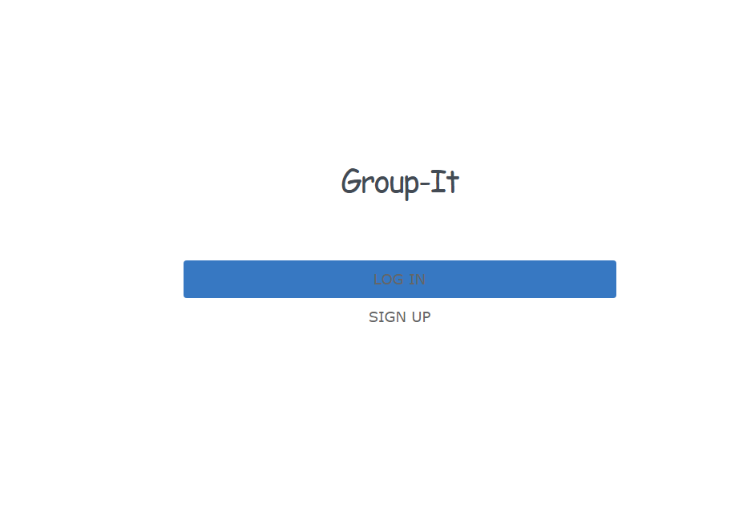
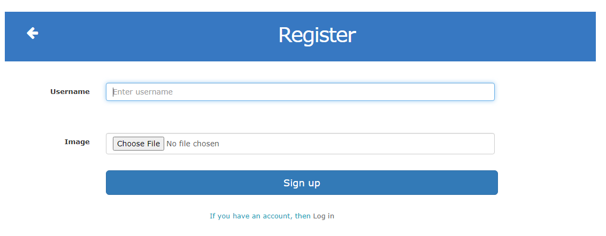
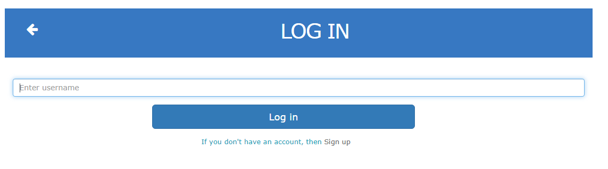
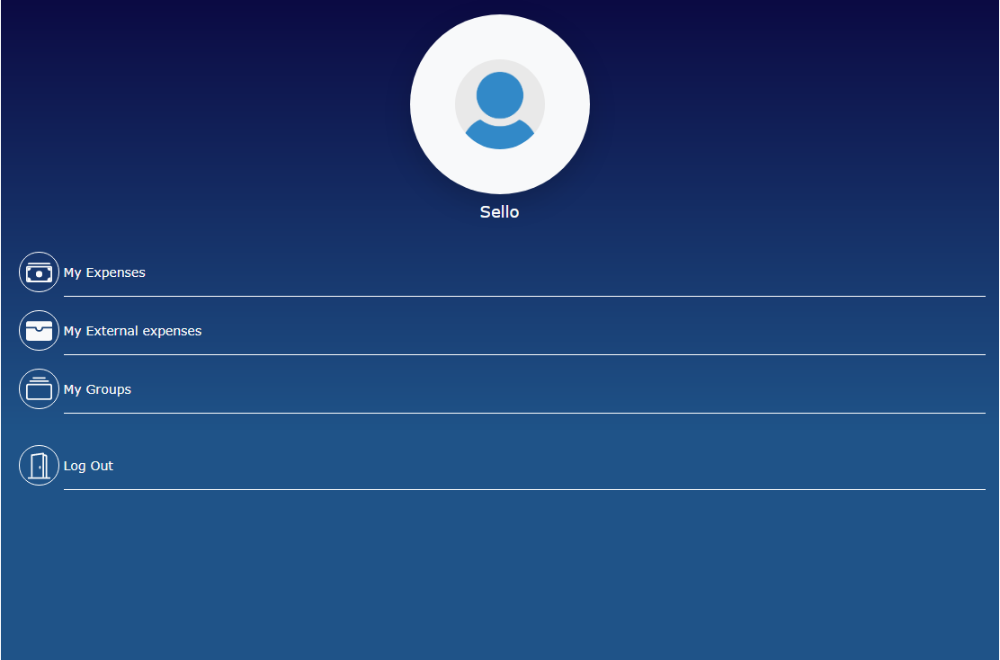
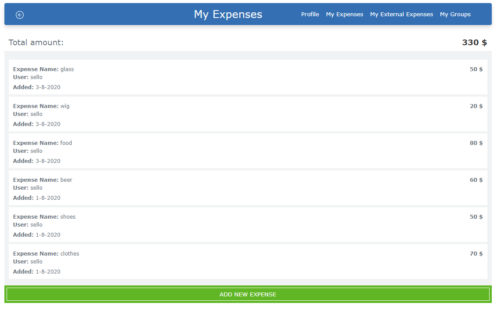
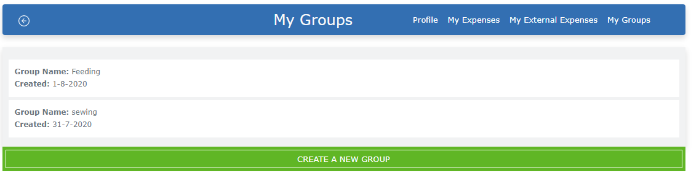
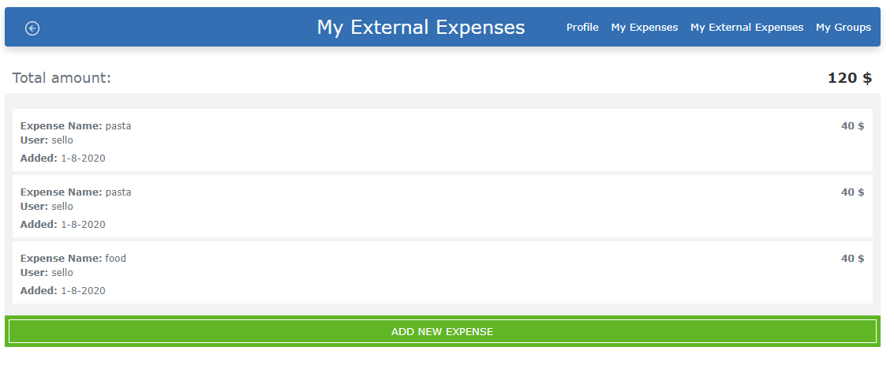

# Group your expenses

> This is the capstone project of the Microverse Ruby on Rails curriculum. This capstone project is completed as part of the Microverse remote software developement curriculum using the pair programming approach.

-In this project I created an expense log app where users can create an account with their username and add expenses spent per day. The expenses can be grouped and ungrouped into the names of their choice

-At Sign up, users can upload images for better UI and UX.

-Users can also view each expenses in each group.

-Users can track the total amount of their expenses.

-This project is built with the MVP approach.

## Check Video Link

[Description Video]()

## Home page

## Create a user account

## Log in page

## Profile page

## Add a new expense

## Groups page

## View external expenses

## Built With

- Ruby,
- Rails,
- HTML,
- CSS,
- Bootstrap

## Live Demo

[Live Demo Link](https://serene-tundra-02609.herokuapp.com/)

### Prerequisites

-Ruby: 2.6.3 Rails: 6.0

### Install and Setup

-Clone repo to your local
> git clone < address >

-Install gems with:
> bundle install

-Setup database with:
> rails db:create

> rails db:migrate

### Usage

-Start server with:
> rails server

Open http://localhost:3000/ in your browser.

### Run tests
-Run:
> rpsec --format documentation

## Author

👤 **Taiwo Coker**

- Github: [@taiwocoker](https://github.com/taiwocoker)
- Twitter: [@SelloCoker](https://twitter.com/SelloCoker)
- Linkedin: [taiwo-coker](https://linkedin.com/in/taiwo-coker)

## 🤝 Contributing

Contributions, issues and feature requests are welcome!

Feel free to check the [issues page](https://github.com/taiwocoker/Group_it/issues)

## Show your support

Give a ⭐️ if you like this project!

## Acknowledgments

You can access all the design info (color, typography, layouts) in this link:

[Design](https://www.behance.net/gallery/19759151/Snapscan-iOs-design-and-branding?tracking_source=)

Design idea by [Gregoire Vella on Behance](https://www.behance.net/gregoirevella)